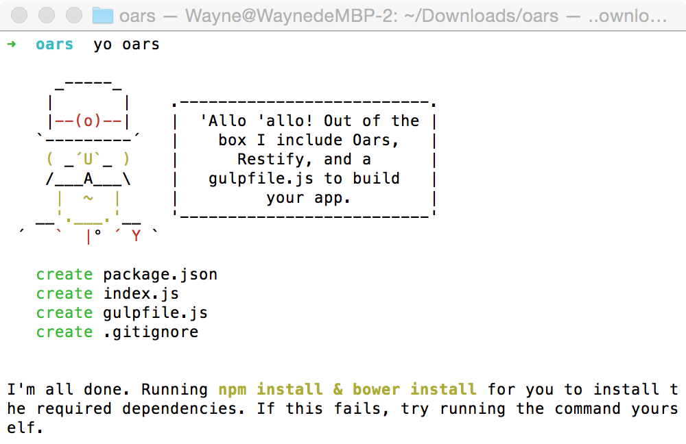

# generator-oars
Oars generator tools for node module oars.

> [Yeoman](http://yeoman.io) generator that scaffolds out a front-end web app using [gulp](http://gulpjs.com/) for the build process

## Getting Started

- Install dependencies: `npm install --global yo bower`
- Install the generator: `npm install --global generator-oars`
- Run `yo oars` to scaffold your webapp
- Run `npm start` to launch your webapp

## Options

- `--skip-welcome-message`
  Skips Yeoman's greeting before displaying options.
- `--skip-install-message`
  Skips the the message displayed after scaffolding has finished and before the dependencies are being installed.
- `--skip-install`
  Skips the automatic execution of `bower` and `npm` after scaffolding has finished.
- `--test-framework=<framework>`
  Defaults to `mocha`. Can be switched for another supported testing framework like `jasmine`.